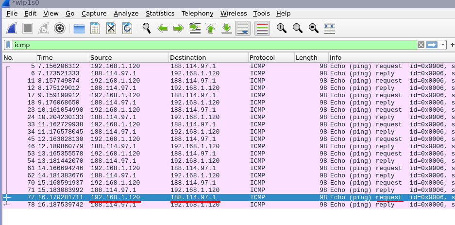
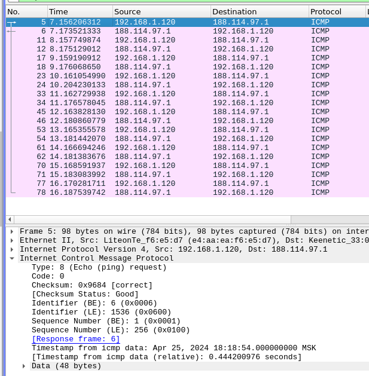
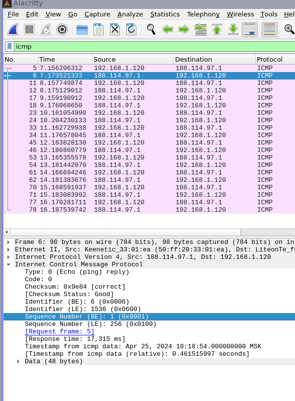
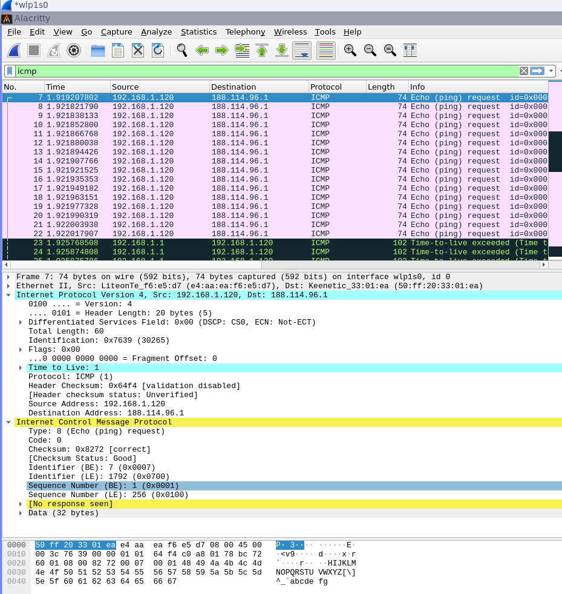
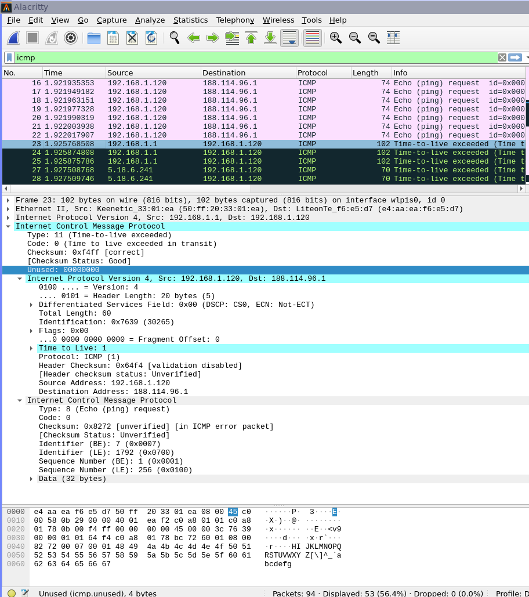
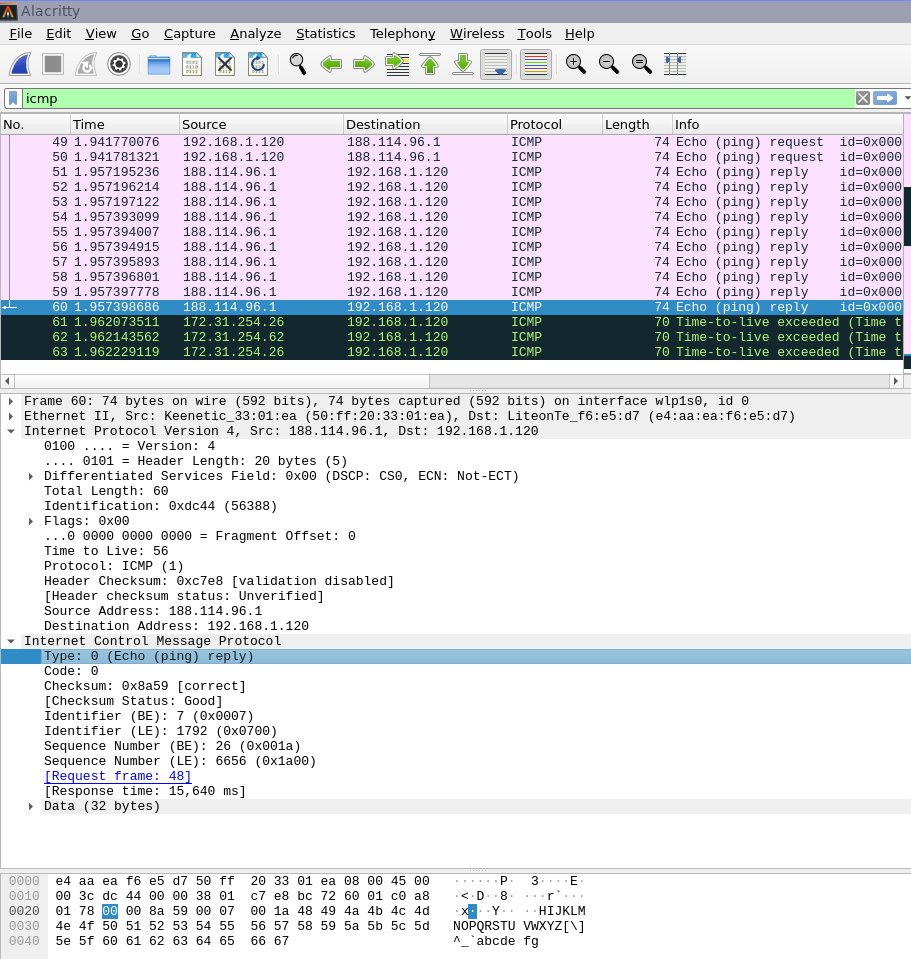
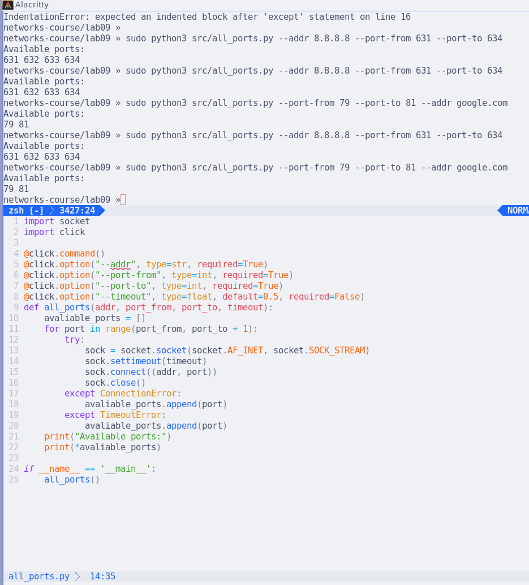

# Практика 9. Сетевой уровень

## Wireshark: ICMP
В лабораторной работе предлагается исследовать ряд аспектов протокола ICMP:
- ICMP-сообщения, генерируемые программой Ping
- ICMP-сообщения, генерируемые программой Traceroute
- Формат и содержимое ICMP-сообщения

### 1. Ping (4 балла)
Программа Ping на исходном хосте посылает пакет на целевой IP-адрес; если хост с этим адресом
активен, то программа Ping на нем откликается, отсылая ответный пакет хосту, инициировавшему
связь. Оба этих пакета Ping передаются по протоколу ICMP.

Выберите какой-либо хост, расположенный на другом континенте (например, в Америке или
Азии). Захватите с помощью Wireshark ICMP пакеты от утилиты ping.
Для этого из командной строки запустите команду (аргумент `-n 10` означает, что должно быть
отослано 10 ping-сообщений): `ping –n 10 host_name`

Для анализа пакетов в Wireshark введите строку icmp в области фильтрации вывода.

```sh
networks-course/lab09 » ping -c 10 tai-e.pascal-lab.net
PING tai-e.pascal-lab.net (188.114.97.1) 56(84) bytes of data.
64 bytes from 188.114.97.1 (188.114.97.1): icmp_seq=1 ttl=56 time=17.3
64 bytes from 188.114.97.1 (188.114.97.1): icmp_seq=2 ttl=56 time=17.4
64 bytes from 188.114.97.1 (188.114.97.1): icmp_seq=3 ttl=56 time=16.9
64 bytes from 188.114.97.1 (188.114.97.1): icmp_seq=4 ttl=56 time=43.2
64 bytes from 188.114.97.1 (188.114.97.1): icmp_seq=5 ttl=56 time=13.9
64 bytes from 188.114.97.1 (188.114.97.1): icmp_seq=6 ttl=56 time=17.1
64 bytes from 188.114.97.1 (188.114.97.1): icmp_seq=7 ttl=56 time=16.1
64 bytes from 188.114.97.1 (188.114.97.1): icmp_seq=8 ttl=56 time=14.7
64 bytes from 188.114.97.1 (188.114.97.1): icmp_seq=9 ttl=56 time=14.5
64 bytes from 188.114.97.1 (188.114.97.1): icmp_seq=10 ttl=56 time=17.

--- tai-e.pascal-lab.net ping statistics ---
10 packets transmitted, 10 received, 0% packet loss, time 9014ms
rtt min/avg/max/mdev = 13.882/18.848/43.208/8.215 ms
```

#### Вопросы

1. Каков IP-адрес вашего хоста? Каков IP-адрес хоста назначения?
   - Мой хост `192.168.1.120`
   - Хост назначения `188.114.97.1`

    
2. Почему ICMP-пакет не обладает номерами исходного и конечного портов?
   - Потому что сетевой уровень ничего не знает про порты, и про конкретные процессы, которые общаются между собой. Сетевой уровень "соединяет" хосты, в то время, как транспортный уровень соединяет процессы.
3. Рассмотрите один из ping-запросов, отправленных вашим хостом. Каковы ICMP-тип и кодовый
   номер этого пакета? Какие еще поля есть в этом ICMP-пакете? Сколько байт приходится на поля 
   контрольной суммы, порядкового номера и идентификатора?
   - 
   - ICMP-тип: 8; код: 0.
   - Есть поле контрольной суммы, идентификатора, порядкового номера, и момент времени.
   - по 2 байта на контрольную сумму; идентификатор и порядковый номер.
4. Рассмотрите соответствующий ping-пакет, полученный в ответ на предыдущий. 
   Каковы ICMP-тип и кодовый номер этого пакета? Какие еще поля есть в этом ICMP-пакете? 
   Сколько байт приходится на поля контрольной суммы, порядкового номера и идентификатора?
   - 
   - Тип теперь 0, а код всё тот же 0.
   - Точно так же есть поля контрольной суммы, идентификатора, порядкового номера и момента времени.
   - Точно так же по 2 байта на каждое из трёх полей.

### 2. Traceroute (4 балла)
Программа Traceroute может применяться для определения пути, по которому пакет попал с
исходного на конечный хост.

Traceroute отсылает первый пакет со значением TTL = 1, второй – с TTL = 2 и т.д. Каждый
маршрутизатор понижает TTL-значение пакета, когда пакет проходит через этот маршрутизатор.
Когда на маршрутизатор приходит пакет со значением TTL = 1, этот маршрутизатор отправляет
обратно к источнику ICMP-пакет, свидетельствующий об ошибке.

Задача – захватить ICMP пакеты, инициированные программой traceroute, в сниффере Wireshark.
В ОС Windows вы можете запустить: `tracert host_name`

Выберите хост, который **расположен на другом континенте**.

#### Вопросы

```sh
networks-course/lab09 » traceroute --icmp tai-e.pascal-lab.net
traceroute to tai-e.pascal-lab.net (188.114.96.1), 30 hops max, 60 byte packets
 1  _gateway (192.168.1.1)  6.580 ms  4.059 ms  4.042 ms
 2  172.31.254.26 (172.31.254.26)  40.224 ms 172.31.254.62 (172.31.254.62)  40.280 ms 172.31.254.26 (172.3
1.254.26)  40.352 ms
 3  5x18x6x241.static-business.spb.ertelecom.ru (5.18.6.241)  5.619 ms  5.606 ms  5.972 ms
 4  172.68.8.3 (172.68.8.3)  13.910 ms  14.142 ms  14.130 ms
 5  172.68.8.2 (172.68.8.2)  18.105 ms  18.092 ms  18.232 ms
 6  * * *
 7  188.114.96.1 (188.114.96.1)  15.528 ms  15.518 ms  15.700 ms
```

1. Рассмотрите ICMP-пакет с эхо-запросом на вашем скриншоте. Отличается ли он от ICMP-пакетов
   с ping-запросами из Задания 1 (Ping)? Если да – то как?
   - 
   - На первый взгляд, если смотреть только на заголовок ICMP, то отличий нет: те же тип, код, тот же набор остальных полей из идентификатора, порядкового номера. Однако, если заглянуть в заголовок IP-дейтаграммы, то там стоит Time to Live: 1, за счёт которого и работает traceroute.
2. Рассмотрите на вашем скриншоте ICMP-пакет с сообщением об ошибке. В нем больше полей,
   чем в ICMP-пакете с эхо-запросом. Какая информация содержится в этих дополнительных полях?
   - 
   - В ответном ICMP-пакете, в отличие от отправленного эхо-пакета, нет идентификатора и порядкового номера, но есть заголовок IP-дейтаграммы эхо-запроса и всё отправленное эхо ICMP-сообщение целиком.
3. Рассмотрите три последних ICMP-пакета, полученных исходным хостом. Чем эти пакеты
   отличаются от ICMP-пакетов, сообщающих об ошибках? Чем объясняются такие отличия?
   - 
   - Здесь тип 0 и код 0 (эхо-ответ), есть идентификатор и порядковый номер, и нет начала IP-дейтаграммы соответствующего эхо-запроса. Это так, потому что этот ICMP-ответ без ошибки: это корректный эхо-ответ. 
4. Есть ли такой канал, задержка в котором существенно превышает среднее значение? Можете
   ли вы, опираясь на имена маршрутизаторов, определить местоположение двух маршрутизаторов,
   расположенных на обоих концах этого канала?

   Здесь мне пришлось выбрать другой сервер, потому что такого канала в предыдущем не было.

   ```sh
    networks-course/lab09 » traceroute --icmp nikovideo.jp
    traceroute to nikovideo.jp (210.157.79.84), 30 hops max, 60 byte packets
     1  _gateway (192.168.1.1)  3.667 ms  3.608 ms  3.590 ms
     2  172.31.254.62 (172.31.254.62)  13.180 ms 172.31.254.26 (172.31.254.26)  13.245 ms 172.31.254.62 (172.3
    1.254.62)  13.221 ms
     3  5x18x6x241.static-business.spb.ertelecom.ru (5.18.6.241)  5.018 ms  5.005 ms  4.993 ms
     4  ertelekom-ic-381104.ip.twelve99-cust.net (213.248.97.53)  6.656 ms  6.636 ms  6.619 ms
     5  sap-b5-link.ip.twelve99.net (213.248.97.52)  6.600 ms  6.591 ms  6.575 ms
     6  80.91.250.99 (80.91.250.99)  18.605 ms  17.294 ms  17.254 ms
     7  * * *
     8  * * *
     9  ldn-b3-link.ip.twelve99.net (62.115.122.181)  38.012 ms  37.998 ms  37.987 ms
    10  iijamerica-ic-378944.ip.twelve99-cust.net (62.115.183.154)  53.808 ms  53.795 ms  53.781 ms
    11  sea001bb00.IIJ.Net (58.138.83.170)  211.024 ms  211.006 ms  210.966 ms
    12  tky009bb10.IIJ.Net (58.138.88.225)  281.899 ms  280.678 ms  280.634 ms
    13  tky009ix54.IIJ.Net (58.138.114.118)  279.458 ms  279.684 ms  279.638 ms
    14  202.232.8.90 (202.232.8.90)  284.650 ms  284.880 ms  284.834 ms
    15  103.3.0.5 (103.3.0.5)  279.132 ms  278.995 ms  283.793 ms
    16  103.3.0.11 (103.3.0.11)  298.795 ms  297.710 ms  297.664 ms
    17  sv3083.wpx.ne.jp (210.157.79.84)  285.822 ms  285.777 ms  285.913 ms
   ```
   Как мы видим, тут явно видно узкое место от 10 до 11. IIJ это японский провайдер Internet Initiative Japan, 10 находится в Америке (IIJ America), 12, похоже, находится в Токио (`tky`), а 11 (`sea`) в океане что ли ?!

## Программирование.

### 1. IP-адрес и маска сети (1 балл)
Напишите консольное приложение, которое выведет IP-адрес вашего компьютера и маску сети на консоль.

#### Демонстрация работы
todo

### 2. Доступные порты (2 балла)
Выведите все доступные (свободные) порты в указанном диапазоне для заданного IP-адреса. 
IP-адрес и диапазон портов должны передаваться в виде входных параметров.

#### Демонстрация работы


### 3. Широковещательная рассылка для подсчета копий приложения (6 баллов)
Разработать приложение, подсчитывающее количество копий себя, запущенных в локальной сети.
Приложение должно использовать набор сообщений, чтобы информировать другие приложения
о своем состоянии. После запуска приложение должно рассылать широковещательное сообщение
о том, что оно было запущено. Получив сообщение о запуске другого приложения, оно должно
сообщать этому приложению о том, что оно работает. Перед завершением работы приложение
должно информировать все известные приложения о том, что оно завершает работу. На экран
должен выводиться список IP адресов компьютеров (с указанием портов), на которых приложение
запущено.

Приложение считает другое приложение запущенным, если в течение промежутка времени,
равного нескольким интервалам между рассылками широковещательных сообщений, от него
пришло сообщение.

**Такое приложение может быть использовано, например, при наличии ограничения на
количество лицензионных копий программ.*

Пример GUI:


#### Демонстрация работы
todo

## Задачи. Работа протокола TCP

### Задача 1. Докажите формулы (3 балла)
Пусть за период времени, в который изменяется скорость соединения с $\frac{W}{2 \cdot RTT}$
до $\frac{W}{RTT}$, только один пакет был потерян (очень близко к концу периода).
1. Докажите, что частота потери $L$ (доля потерянных пакетов) равна
   $$L = \dfrac{1}{\frac{3}{8} W^2 + \frac{3}{4} W}$$
2. Используйте выше полученный результат, чтобы доказать, что, если частота потерь равна
   $L$, то средняя скорость приблизительно равна
   $$\approx \dfrac{1.22 \cdot MSS}{RTT \cdot \sqrt{L}}$$

#### Решение
todo

### Задача 2. Найдите функциональную зависимость (3 балла)
Рассмотрим модификацию алгоритма управления перегрузкой протокола TCP. Вместо
аддитивного увеличения, мы можем использовать мультипликативное увеличение. 
TCP-отправитель увеличивает размер своего окна в небольшую положительную 
константу $a$ ($a > 1$), как только получает верный ACK-пакет.
1. Найдите функциональную зависимость между частотой потерь $L$ и максимальным
размером окна перегрузки $W$.
2. Докажите, что для этого измененного протокола TCP, независимо от средней пропускной
способности, TCP-соединение всегда требуется одинаковое количество времени для
увеличения размера окна перегрузки с $\frac{W}{2}$ до $W$.

#### Решение
todo
